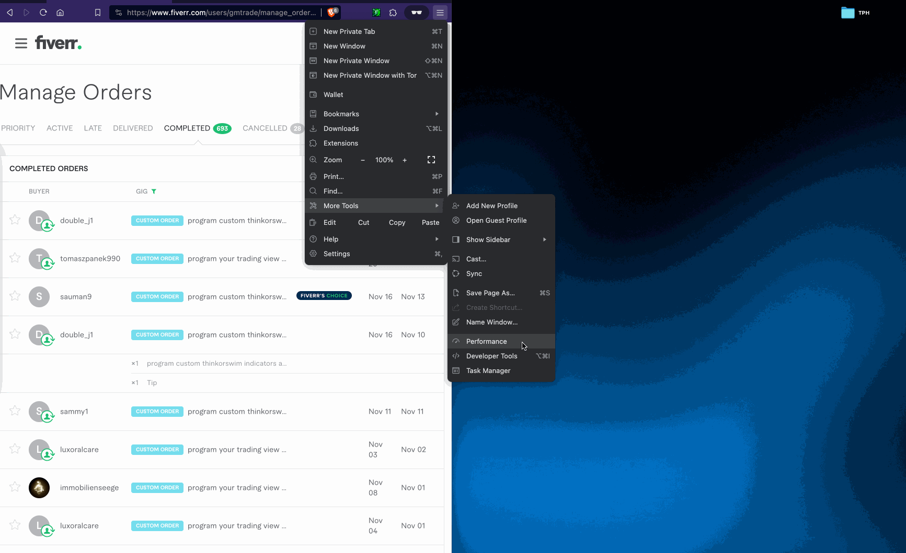

# Fiverr Order Scraper

If you need to retrieve all of your deliveries from your Fiverr account, I've built a scraper/chrome extension to help in a semi-automated fashion. I needed to get over 700 orders and their deliveries from Fiverr. Primarily the attachments that weren't videos from the delivery. I initially attempted to use a headless browser with Puppeteer but encountered bot detection issues. This solution is faster and served my needs fairly-well, but would need some love to get it rock solid. Please note that I can't guarantee it will work flawlessly for everyone. However, this should provide you with a solid starting point if you require a similar solution.

**Instructions:**

**Step 1:** Install the Chrome Extension.

**Step 1a:** You might want to nstall for use in an separate browser so the opening/closing of tabs to download deliveries doesnt take over your main browser.

**Step 1b:** Enable automatic downloads in chrome. (So it doesn't ask you where to save the file)

**Step 2:** Visit your Orders Page 👉🏻 (https://www.fiverr.com/users/{yourUsername}/manage_orders?source=header_nav&search_type=completed)

**Step 3:** Click on the Chrome Extension Icon to begin.

**Step 4:** Ensure you don't leave the page during the process.

**Step 5:** All your Order IDs will be downloaded in the background.

**Step 6:** Once your Order IDs are downloaded, it will start opening new tabs to download the delivery files, excluding any video files. If there were multiple deliveries it only downloads the last few that are initially visible when opening a new tab.

**Step 7:** There are pauses in place to avoid triggering any throttling measures.

**Step 8:** An alert will display when the process is finished!

**Step 9:** Enjoy!
